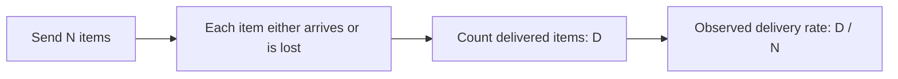

# Worked example: loss in a fictional delivery system

This is a teaching-design example, not a networking benchmark or a prediction about real protocols. All numbers below are hypothetical. It demonstrates how to turn one mechanism into an interactive lesson without inventing empirical evidence.

## Learning goal

The reader can calculate how many items were delivered and distinguish an observed delivery rate from the probability of future success.

## Direct answer

In this fictional system, some items do not arrive. Counting the items that arrive tells us the observed delivery rate for that batch, not a guarantee for the next batch.

## Overall diagram

Text alternative: start with a batch of N items, identify which arrive, count D delivered items, and divide D by N.

## Hands-on example

Use two labeled numeric controls:

- Items sent N: an integer from 1 to 100, initially 20.
- Items lost L: an integer from 0 to N, initially 3.

When N changes, clamp L to the new valid range and visibly report the adjustment. Show:

- Delivered items: D = N - L.
- Observed delivery rate: 100 * D / N percent.
- Observed loss rate: 100 * L / N percent.

For the initial batch, D = 17, delivery rate = 85%, and loss rate = 15%. Display percentages rounded to one decimal place; use unrounded values for calculations.

Show 20 labeled item markers, including 3 marked "lost" and 17 marked "delivered". Use text or shape as well as color. For larger batches, a text count may replace individual markers. Announce changed results in a polite live region.

No random sampling is needed. The user selects the observed loss count, so the page must not call it a probability simulation.

## Misconceptions and limits

- "85% arrived, so the next item has an 85% chance of arriving." This observation alone does not establish a future probability.
- "A lost item always means a real application loses data permanently." This toy system includes no retries or recovery; real behavior depends on the actual system.
- "Two batches with the same rate are equally strong evidence." A count from 20 items and a count from 2,000 items contain different amounts of information; this lesson does not calculate statistical confidence.

## Comprehension checks

1. If N = 20 and L = 5, how many arrive? Answer: 15, or 75% of this batch.
2. If N = 10 and L = 0, does that guarantee the next batch has no loss? Answer: no; it describes only this batch.
3. Why must L not exceed N? Answer: this model counts each sent item at most once as lost.

## Acceptance checks

| Input | Expected result |
|---|---|
| N = 20, L = 3 | D = 17; delivery 85.0%; loss 15.0% |
| N = 1, L = 0 | D = 1; delivery 100.0%; loss 0.0% |
| N = 1, L = 1 | D = 0; delivery 0.0%; loss 100.0% |
| N changes to 2 while L = 3 | L becomes 2 and the adjustment is reported |

## Source statement

This is an invented system. The outputs follow directly from the displayed definitions and arithmetic. It makes no factual claims about measured network performance. A lesson about real protocols would need appropriate primary sources.

## Prompt to build it

> Use understanding-studio and this specification to produce a single offline HTML file. Implement the numeric controls, the diagram, the results, the misconceptions, and the answer reveals. Use safe DOM methods, no external dependencies, no browser storage, and no network requests. Run the checks you can actually run, and state which checks remain untested.
